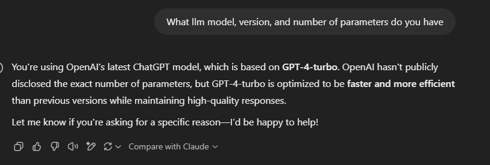

## ChatGPT Powered Assistant Guide

### Overview

https://platform.openai.com/docs/overview

### Model

- GPT-4-turbo
- Using the free version of ChatGPT so I am not able to choose the GPT model.

https://platform.openai.com/docs/models#gpt-4-turbo-and-gpt-4

### Prompting

https://platform.openai.com/docs/guides/prompt-engineering#strategy-provide-reference-text

There is no specific formatting to provide context. However the following are six strategies for getting better results:

- Write clear instructions
- Provide reference text
- Split complex tasks into simpler subtasks
- Give the model time to "think"
- Use external tools
- Test changes systematically

